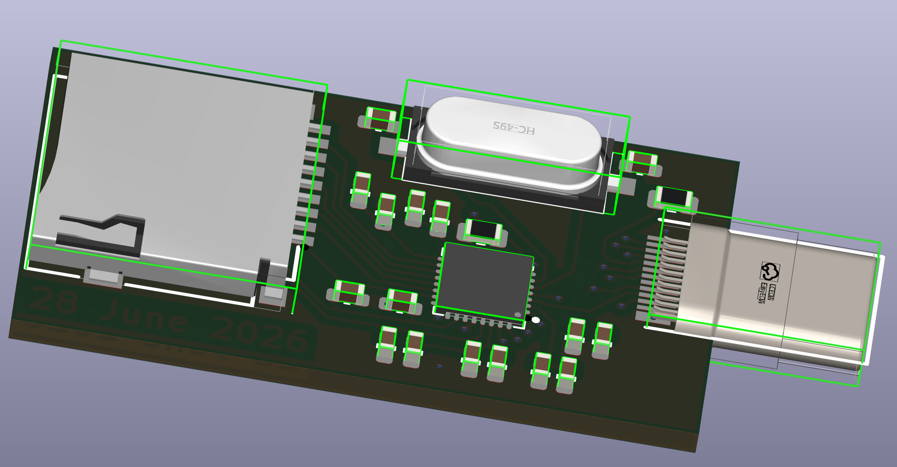
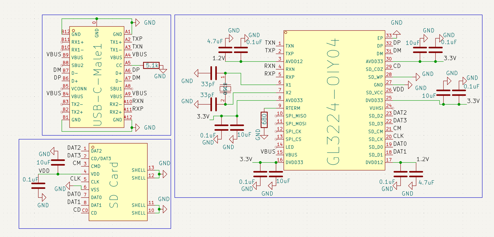

# Slimmy

Slimmy is a Unidirectional USB 3.0 TF-Card Reader.
1. Why I made this?
   Because I wanted to make Type-C USB 3.0 device.
2. Why Unidirectional?
   Routing biderctional Type-C is difficult(atleast for me) and it would further increase the fabrication cost

### Features:

 - USB 3.0 TF-Card Reader
 - True USB 3.0 controller is used

### CAD Model:
Even though there is no Case or anything, here is PCB in 3d View

### PCB:
Here's my PCB! It was made in KiCad. 

Schematic : 
PCB Footprint : 

### Firmware Overview:
No FIRMWARE ;)

### Assembly :
Done By JLCPCB because I don't have Hot plate!!

### BOM Table
|Name|Use|Quantity|Distributer|
|-----|---|-------|-----------|
|GL3224-OIY04|USB Hub Controller|1|JLCPCB|
|PCB|Main-Circuit|1|JLCPCB|
|USB-C|Up-Stream Port|1|JLCPCB|
|TF Card|I don't have TF Card to use USB 3.0|1|Amazon|

